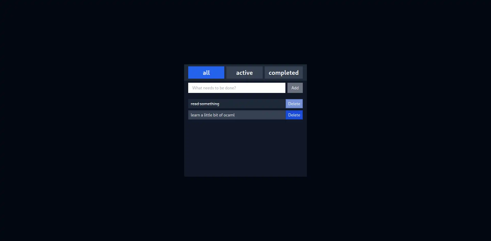

# 🫠 Web UTILS REScript

## Description

This is just a simple project to test the [rescript](https://rescript-lang.org/) language.

It consist a simple todo list with a few features:

- Add a new todo
- Remove a todo
- Mark a todo as done
- Filter todos by status
- Save todos in local storage



I know that this is a simple project, but I'm just testing the language.

## How to run

```bash
pnpm install
pnpm dev
```
